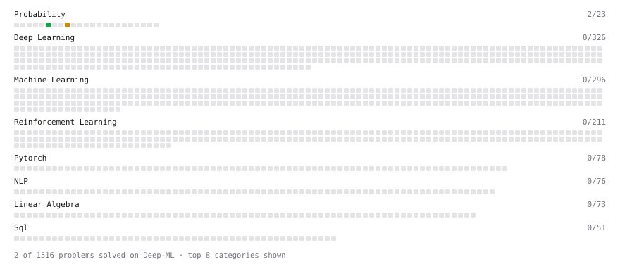

# Deep-ML

My machine learning practice from [Deep-ML](https://www.deep-ml.com). Every solution here was written by hand.

**7** solved · 7 problems · 0 labs · 0 math

[**Browse the interactive portfolio**](https://bluescorpion21112005-create.github.io/deep-ml/) to replay this filling in over time.

## Problems

| | Difficulty | Solved | |
| --- | --- | --- | --- |
| [Calculate Conditional Probability from Data](https://www.deep-ml.com/problems/168) | easy | 2026-10-09 | [solution](problems/0168-calculate-conditional-probability-from-data) |
| [Compute Posterior Probability using Bayes' Theorem](https://www.deep-ml.com/problems/336) | easy | 2026-10-09 | [solution](problems/0336-compute-posterior-probability-using-bayes-theorem) |
| [Demonstrate Law of Large Numbers with Sampling](https://www.deep-ml.com/problems/342) | easy | 2026-10-10 | [solution](problems/0342-demonstrate-law-of-large-numbers-with-sampling) |
| [Binomial Distribution Probability](https://www.deep-ml.com/problems/79) | medium | 2026-10-09 | [solution](problems/0079-binomial-distribution-probability) |
| [Central Limit Theorem Simulation](https://www.deep-ml.com/problems/182) | medium | 2026-10-10 | [solution](problems/0182-central-limit-theorem-simulation) |
| [Conditional Probability from Joint Distribution](https://www.deep-ml.com/problems/180) | medium | 2026-10-09 | [solution](problems/0180-conditional-probability-from-joint-distribution) |
| [Normal Distribution PDF Calculator](https://www.deep-ml.com/problems/80) | medium | 2026-10-09 | [solution](problems/0080-normal-distribution-pdf-calculator) |

---

_This file is regenerated by Deep-ML on every push._
